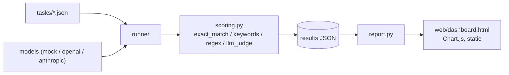

# LLM Benchmark Panel


A multi-provider LLM benchmarking harness: define task suites, run any mix of
models against them, score responses (rule-based or LLM-as-judge), and get a
static comparison dashboard — accuracy, latency, and cost, side by side.

## Why this design

- **Runs with zero API keys.** `mock:*` providers are deterministic,
  network-free simulated model "personas" (`frontier-sim`, `mid-sim`,
  `budget-sim`) with different accuracy/latency/cost profiles, seeded by
  `hash(model, task_id)` so a run is reproducible. `data/results/demo_results.json`
  and `web/dashboard.html` in this repo were generated by *actually running*
  the harness against them — not hand-written sample data.
- **Real providers are a one-line swap.** `openai:gpt-4o-mini` or
  `anthropic:claude-3-5-haiku-latest` work the moment the matching API key is
  set — `providers.py` is the only file that knows about HTTP.
- **Scoring is pluggable per task**, not one-size-fits-all: `exact_match` for
  crisp answers, `keywords` (all/any) for short free text, `regex` for
  pattern-shaped output, and `llm_judge` for anything that needs a rubric.
  Rule-based scorers are deterministic and free — the judge scorer is opt-in.
- **Cost is estimated, not assumed away.** `cost.py` has an illustrative
  $/1K-token table per model so a benchmark run reports accuracy *and* what
  each model's accuracy cost.

## Quickstart

```bash
python -m venv .venv && source .venv/bin/activate
pip install -e ".[dev]"

# Fully offline demo — three simulated model personas, zero API keys
llm-bench run --models mock:frontier-sim,mock:mid-sim,mock:budget-sim --suite all \
  --output data/results/demo_results.json

llm-bench report --results data/results/demo_results.json --output web/dashboard.html
# open web/dashboard.html in a browser
```

Or regenerate the bundled demo results + dashboard in one step:

```bash
python scripts/regenerate_demo.py
# equivalently: make demo
```

### Benchmarking real models

```bash
export OPENAI_API_KEY=sk-...
export ANTHROPIC_API_KEY=sk-ant-...
llm-bench run --models openai:gpt-4o-mini,anthropic:claude-3-5-haiku-latest --suite reasoning,coding
```

```bash
llm-bench list-models        # see every built-in mock persona + how to name real ones
llm-bench run --help         # all flags
llm-bench run -v --models …  # -v/--verbose enables per-task debug output
```

### Optional environment variables

| Variable | Default | Description |
|---|---|---|
| `OPENAI_API_KEY` | — | Required for `openai:*` models |
| `ANTHROPIC_API_KEY` | — | Required for `anthropic:*` models |
| `JUDGE_MODEL` | — | Model id used for `llm_judge`-scored tasks |
| `LLM_BENCH_TIMEOUT` | `60` | HTTP timeout (seconds) for real API providers |
| `LLM_BENCH_MAX_TOKENS` | `1024` | Max tokens requested from real API providers |

## Task suites

`tasks/*.json` — `reasoning`, `coding`, `turkish` (Turkish-language grammar,
vocabulary and finance-domain questions, since this harness doubles as a way
to compare how well different models handle Turkish). Each task:

```json
{
  "id": "reasoning_arithmetic_1",
  "category": "reasoning",
  "prompt": "What is 17 multiplied by 6? Write only the number.",
  "scorer": { "type": "exact_match", "expected": "102" }
}
```

Add a suite by dropping a new `tasks/<name>.json` file — `--suite all` picks
up every file automatically. Task ids must be globally unique across all suites.
See [CONTRIBUTING.md](CONTRIBUTING.md) for the full scorer reference.

## Architecture



## Project layout

```
src/llm_bench/
  cli.py            # run / report / list-models subcommands
  runner.py          # runs models × tasks, scores, aggregates
  providers.py        # mock personas + OpenAI / Anthropic adapters
  tasks.py             # task suite loading + validation
  scoring.py            # exact_match / keywords / regex / llm_judge
  cost.py                # illustrative $/1K-token pricing table
  storage.py              # save/load results JSON (atomic writes)
  report.py                # static HTML dashboard generator
tasks/                       # bundled task suites (reasoning, coding, turkish)
data/results/                  # demo_results.json (committed, reproducible)
web/dashboard.html               # generated dashboard for the demo run
tests/                             # pytest suite (45 tests, ≥80% coverage enforced)
scripts/regenerate_demo.py           # regenerates demo_results.json + dashboard.html
```

## Development

```bash
make install   # pip install -e ".[dev]" + pre-commit install
make lint      # ruff check src tests
make fmt       # ruff format src tests
make test      # pytest --cov=llm_bench
make demo      # python scripts/regenerate_demo.py
make clean     # remove __pycache__, .coverage, dist, build
```

The test suite runs entirely against `mock:*` providers — no network, no API
keys, safe in CI. Coverage is enforced at 80% minimum by `pytest --cov-fail-under=80`.

## Honest limitations

- `exact_match` and `keywords` scoring is easy to game by an unhelpfully terse
  or verbose model; it's a starting point, not a publication-grade eval
  methodology. `llm_judge` is the intended answer for subjective grading.
- The cost table in `cost.py` is illustrative and will drift — check current
  provider pricing before trusting a cost comparison for a real decision.
- `mock:*` personas demonstrate the harness's plumbing, not real model
  capability. Swap in `openai:`/`anthropic:` model ids for results that mean
  something about actual quality.

## Contributing

See [CONTRIBUTING.md](CONTRIBUTING.md).

## License

MIT — see [LICENSE](LICENSE).

## Roadmap ideas

- More task suites (long-context, tool-use, multi-turn)
- Streaming responses + token-by-token latency (time-to-first-token)
- A results-over-time view (track a model's score across repo history)
- Local model support via an Ollama provider
