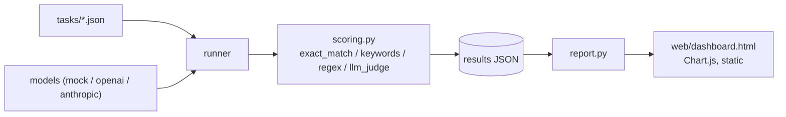

# LLM Benchmark Panel

A multi-provider LLM benchmarking harness: define task suites, run any mix of
models against them, score responses (rule-based or LLM-as-judge), and get a
static comparison dashboard — accuracy, latency, and cost, side by side.

## Why this design

- **Runs with zero API keys.** `mock:*` providers are deterministic,
  network-free simulated model "personas" (`frontier-sim`, `mid-sim`,
  `budget-sim`) with different accuracy/latency/cost profiles, seeded by
  `hash(model, task_id)` so a run is reproducible. `data/results/demo_results.json`
  and `web/dashboard.html` in this repo were generated by *actually running*
  the harness against them — not hand-written sample data — so the dashboard
  you open is a real (simulated) benchmark run, not a mockup.
- **Real providers are a one-line swap.** `openai:gpt-4o-mini` or
  `anthropic:claude-3-5-haiku-latest` (or any other model id) work the moment
  the matching API key is set — `providers.py` is the only file that knows
  about HTTP.
- **Scoring is pluggable per task**, not one-size-fits-all: `exact_match` for
  crisp answers, `keywords` (all/any) for short free text, `regex` for
  pattern-shaped output (code, emails), and `llm_judge` for anything that
  needs a rubric and a grading model. Rule-based scorers are deterministic
  and free — the judge scorer is opt-in because it costs a call.
- **Cost is estimated, not assumed away.** `cost.py` has an illustrative
  $/1K-token table per model (documented as a placeholder to keep current —
  provider pricing changes) so a benchmark run reports accuracy *and* what
  each model's accuracy cost.

## Quickstart

```bash
python -m venv .venv && source .venv/bin/activate
pip install -e ".[dev]"

# Fully offline demo — three simulated model personas, zero API keys
llm-bench run --models mock:frontier-sim,mock:mid-sim,mock:budget-sim --suite all \
  --output data/results/demo_results.json

llm-bench report --results data/results/demo_results.json --output web/dashboard.html
# open web/dashboard.html in a browser
```

Or regenerate the bundled demo results + dashboard in one step:

```bash
python scripts/regenerate_demo.py
```

### Benchmarking real models

```bash
export OPENAI_API_KEY=sk-...
export ANTHROPIC_API_KEY=sk-ant-...
llm-bench run --models openai:gpt-4o-mini,anthropic:claude-3-5-haiku-latest --suite reasoning,coding
```

```bash
llm-bench list-models   # see every built-in mock persona + how to name real ones
```

## Task suites

`tasks/*.json` — `reasoning`, `coding`, `turkish` (Turkish-language grammar,
vocabulary and finance-domain questions, since this harness doubles as a way
to compare how well different models actually handle Turkish, not just
English). Each task:

```json
{
  "id": "reasoning_arithmetic_1",
  "category": "reasoning",
  "prompt": "17 çarpı 6 kaçtır? Sadece sayıyı yaz.",
  "scorer": { "type": "exact_match", "expected": "102" }
}
```

Add a suite by dropping a new `tasks/<name>.json` file — `--suite all` picks
up every file automatically, task ids must stay globally unique.

## Architecture



## Project layout

```
src/llm_bench/
  tasks.py        # task suite loading + validation
  providers.py     # mock personas + OpenAI/Anthropic adapters
  scoring.py        # exact_match / keywords / regex / llm_judge
  cost.py             # illustrative $/1K-token pricing table
  runner.py            # runs models x tasks, scores, aggregates
  storage.py             # save/load results JSON
  report.py                # static HTML dashboard generator
  cli.py                     # run / report / list-models
tasks/               # bundled task suites (reasoning, coding, turkish)
data/results/          # demo_results.json (committed, reproducible)
web/dashboard.html        # generated dashboard for the demo run
tests/                       # pytest suite
scripts/regenerate_demo.py     # regenerates demo_results.json + dashboard.html
```

## Testing

```bash
pytest --cov=llm_bench
```

Everything in the test suite runs against `mock:*` providers — no network,
no API keys, safe in CI.

## Honest limitations

- `exact_match` and `keywords` scoring is easy to game by an unhelpfully
  terse or unhelpfully verbose model; it's a starting point, not a
  publication-grade eval methodology. `llm_judge` is the intended answer for
  subjective grading, at the cost of an extra LLM call per graded response.
- The cost table in `cost.py` is illustrative and will drift — check current
  provider pricing before trusting a cost comparison for a real decision.
- `mock:*` personas are *simulated* — they demonstrate the harness's
  plumbing (runner, scoring, cost estimation, dashboard), not real model
  capability. Swap in real `openai:`/`anthropic:` model ids for results that
  mean anything about actual model quality.

## Roadmap ideas

- More task suites (long-context, tool-use, multi-turn)
- Streaming responses + token-by-token latency (time-to-first-token)
- A results-over-time view (track a model's score across repo history)
- Local model support via an Ollama provider
